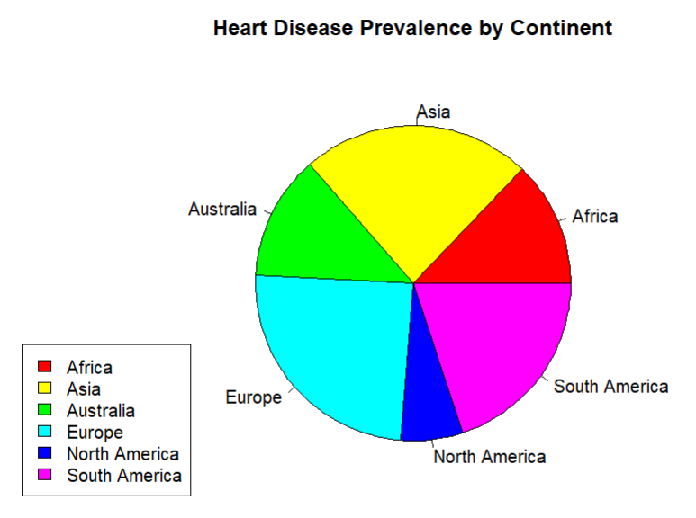

# Heart Disease Analysis by Country

This project investigates the factors influencing heart disease occurrence numbers across different countries. The analysis utilizes three datasets from Kaggle to explore potential correlations between alcohol consumption, air quality, and heart disease rates.

## Datasets

The following datasets were used in this analysis:

1. **Heart Attack Risk Prediction Dataset**: Contains heart disease risk data by country.
2. **Alcohol Consumption by Country**: Provides data on alcohol consumption per capita by country.
3. **Global Air Pollution Dataset**: Contains the Air Quality Index (AQI) values by city for each country.

## Objective

The primary goal of this project is to analyze whether alcohol consumption and AQI have an impact on the occurrence of heart disease in various countries.

## Steps Involved

1. **Data Preprocessing**: 
   - Loaded the datasets and performed necessary data cleaning (e.g., removing missing values).
   - Aggregated data by country for comparison.

2. **Data Analysis**:
   - Investigated whether there is any relationship between alcohol consumption, AQI, and heart disease occurrence numbers.

3. **Data Visualization**:
   - Created the following four key visualizations to explore the data:

### 1. Pie Chart: Heart Disease Distribution by Continent
This pie chart shows the proportion of heart disease occurrences by continent, highlighting which continents have higher or lower heart disease rates.

### 2. Bar Chart: Number of Heart Disease Occurrences by Country
This bar chart provides a clear comparison of heart disease occurrences across different countries, helping to identify countries with notably high or low numbers. The bars have continuous color coding that reflects the risk level of heart diseases in that country.

### 3. Scatter Plot: Heart Disease Occurrence vs. Alcohol Consumption
A scatter plot was used to explore the potential relationship between alcohol consumption and heart disease rates. A slight positive correlation can be observed, suggesting that higher alcohol consumption might be associated with a higher occurrence of heart disease.

### 4. Box Plot: Heart Disease Occurrence vs. AQI
The box plot reveals an interesting finding: countries with low AQI values tend to have higher mean heart disease occurrences compared to countries with high AQI values.

## Conclusions

- **Alcohol Consumption**: The scatter plot suggests a slight positive correlation between alcohol consumption and heart disease occurrences, but further statistical analysis is needed to determine causality.
- **AQI**: The box plot shows that low AQI countries appear to have higher heart disease occurrences, which might suggest a relationship between pollution and health risks, though more analysis is required.

## Tools Used

- **R**: For data cleaning, manipulation, and analysis.
- **ggplot2**: For creating statistical visualizations (pie chart, bar chart, scatter plot, box plot).
- **dplyr**: For data manipulation and aggregation.
- **tidyr**: For tidying the data and reshaping it for analysis.
